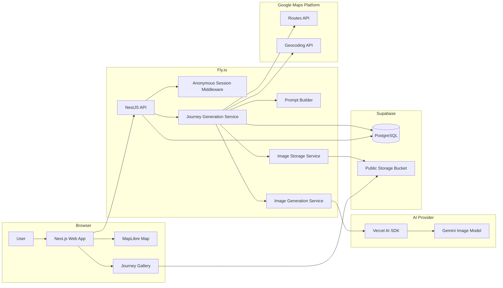

# RouteLens System Design

## Product Summary

RouteLens is a geography-focused AI image generation app that turns a selected route into a visual journey.

Users pick an origin and destination on a MapLibre map. RouteLens calculates or approximates the route, creates three scenes for the journey, writes prompts for those scenes, generates AI images through a backend service, stores the results server-side, and shows the route with a persistent gallery.

The generated images are not exact street-view reconstructions. They are visual impressions created from route geography and user-selected style.

Product positioning:

> AI-generated scenes inspired by the geography along your route.

## User Journey

1. The user opens RouteLens and sees an interactive map.
2. The user selects an origin point.
3. The user selects a destination point.
4. The app opens a confirmation panel showing the selected route request.
5. The user chooses one fixed style preset.
6. The user confirms generation.
7. The frontend sends the route request to the backend.
8. The backend creates a journey record for the user's anonymous session.
9. The backend calculates or approximates the route.
10. The backend creates three scene points: departure, midway, and arrival.
11. The backend writes AI prompts for each scene point.
12. The backend calls the AI image API for each scene.
13. The backend validates each AI response, stores image files server-side, and saves scene metadata.
14. The frontend shows real progress states while the backend works.
15. When generation finishes, the frontend shows the route, origin marker, destination marker, scene markers, and generated image gallery.
16. The user can open a saved scene, view its image history, tweak its prompt, and regenerate that scene without starting the route over.

## Request Journey

The browser never calls the AI image API directly. All AI calls go through the NestJS backend.

1. Browser sends `POST /journeys` with:
   - origin coordinates
   - destination coordinates
   - visual style preset
2. NestJS validates the request and resolves the anonymous session.
3. NestJS creates a `Journey` record with status `creating_route`.
4. NestJS calculates the route through a routing provider, or falls back to a straight-line route if needed.
5. NestJS creates departure, midway, and arrival scene points and updates status to `choosing_scene_points`.
6. NestJS writes scene prompts and updates status to `writing_prompts`.
7. NestJS calls the AI image API from the backend and updates status to `generating_images`.
8. NestJS validates image responses and uploads generated images to server-side storage.
9. NestJS stores scene metadata and image storage keys in PostgreSQL.
10. NestJS updates the journey status to `completed`, `completed_with_errors`, or `failed`.
11. Browser polls `GET /journeys/:id` and updates the progress modal until the journey is complete or failed.
12. Browser renders the final route map and gallery from backend data.

## Progress States

The app exposes meaningful progress instead of a generic spinner.

- `creating_route`: validating coordinates and building route geometry
- `choosing_scene_points`: selecting representative points along the route
- `writing_prompts`: turning route points into AI image prompts
- `generating_images`: waiting for the AI image API
- `saving_gallery`: storing images and metadata server-side
- `completed`: route gallery is ready
- `completed_with_errors`: route gallery is ready, but one or more scene images failed
- `failed`: route gallery could not be generated

The frontend displays these states in a modal while the backend is processing. Since AI image generation can take 10 to 30 seconds, the UI is designed around waiting instead of hiding it.

## Tech Stack

### Frontend

- React and Next.js
- TypeScript
- MapLibre GL for map interaction and route visualization

Next.js is used for a fast React development workflow and straightforward deployment. MapLibre is used because RouteLens is map-first, and the user journey begins with selecting points directly on a map.

### Backend

- NestJS
- TypeScript
- PostgreSQL
- Prisma

NestJS is used because it gives the backend clear modules, services, controllers, validation, and dependency boundaries. This matches the target role's stack and makes the AI, routing, storage, and journey logic easier to explain.

PostgreSQL stores journeys, scenes, statuses, errors, prompts, coordinates, and storage keys. Prisma is used for readable schema management and type-safe database access.

### Storage

- Supabase Storage

Generated images are stored in a public Supabase Storage bucket by the NestJS backend. PostgreSQL stores the storage path, public URL, and image metadata. Public image URLs keep the deployed gallery simple and reliable for the MVP. A production version with full user accounts could move to private buckets and signed URLs.

### AI Image API

- Vercel AI SDK
- Gemini image generation

The backend owns all AI calls. The frontend only talks to RouteLens APIs. This keeps API keys and AI provider details out of the browser and allows the backend to normalize timeout, invalid response, and retry behavior.

RouteLens uses an internal image generation service abstraction backed by the Vercel AI SDK. The MVP uses Gemini as the first image provider because the project already has prior AI SDK experience and provider swapping remains isolated from journey-generation logic.

### Routing

- Google Routes API
- Google Geocoding API
- Straight-line fallback route

Google Routes API is the primary route provider. Google Geocoding API enriches scene points with human-readable place labels. If Google routing or geocoding fails, RouteLens can fall back to a straight-line route and coordinate-only prompts, then label the result as an approximation.

MapLibre remains the frontend map renderer. Google APIs are used on the backend for route geometry and place labels.

### User Separation

- Anonymous session cookie

Full authentication is intentionally out of scope for the MVP. Each browser receives an anonymous session id, and all journeys are scoped to that session. This allows multiple users to generate at the same time without seeing each other's galleries.

The anonymous session cookie is `httpOnly`, `sameSite=lax`, signed, and configured with a reasonable expiry such as 30 days.

### Deployment

- Fly.io app for the Next.js frontend
- Fly.io app for the NestJS backend
- Supabase for PostgreSQL and generated image storage

The frontend and backend are deployed as separate Fly.io apps. This keeps the architecture easy to inspect and avoids running multiple production processes inside one container.

## Architecture



Repository layout:

```text
.
├── api/
│   ├── prisma/                 schema and migrations
│   ├── src/
│   │   ├── auth/               anonymous session middleware
│   │   ├── journeys/           controllers, generation service, route orchestration
│   │   ├── scenes/             scene regeneration and image history
│   │   ├── geo/                Google Routes, Geocoding, and fallback route services
│   │   ├── ai/                 Vercel AI SDK image generation adapter
│   │   ├── storage/            Supabase Storage adapter
│   │   ├── prisma/             Prisma client lifecycle
│   │   └── main.ts             HTTP, CORS, cookies, and bootstrap
│   └── test/                   focused backend unit tests
├── web/
│   └── src/
│       ├── app/                Next.js routes and app shell
│       ├── features/map/       MapLibre route selection and overlays
│       ├── features/journeys/  confirmation panel, progress modal, gallery
│       ├── features/scenes/    prompt editing, regeneration, image history
│       └── lib/                API client and shared formatting
├── docs/
│   └── system-design.md
└── README.md
```

## Core API Design

### Create Journey

`POST /journeys`

Creates a journey generation job.

Request body:

```json
{
  "origin": {
    "lat": -6.2088,
    "lng": 106.8456
  },
  "destination": {
    "lat": -6.1754,
    "lng": 106.8272
  },
  "style": "travel_poster"
}
```

Response body:

```json
{
  "journeyId": "journey_123",
  "status": "creating_route"
}
```

### Get Journey

`GET /journeys/:id`

Returns the latest journey status, route geometry, scenes, and any error details. The frontend polls this endpoint while generation is in progress.

Example response shape:

```json
{
  "id": "journey_123",
  "status": "generating_images",
  "routeMode": "google_routes",
  "completedImages": 1,
  "totalImages": 3,
  "scenes": [
    {
      "id": "scene_1",
      "label": "departure",
      "activeImage": {
        "status": "completed",
        "version": 1,
        "imageUrl": "https://example.supabase.co/storage/v1/object/public/route-lens-generated/..."
      },
      "images": []
    }
  ]
}
```

### List Journeys

`GET /journeys`

Returns saved journeys for the current anonymous session.

### Regenerate Scene

`POST /scenes/:id/regenerate`

Regenerates one saved scene with an edited prompt. The existing journey remains intact.

Request body:

```json
{
  "prompt": "A rainy cinematic evening scene near the route, with warm street lights and dramatic clouds"
}
```

Regeneration creates a new scene image version. The latest successful version becomes the active gallery image, while previous versions remain visible in the scene history UI.

## Data Model

### Journey

- `id`
- `sessionId`
- `originLat`
- `originLng`
- `destinationLat`
- `destinationLng`
- `routeGeojson`
- `routeMode`
- `style`
- `status`
- `errorCode`
- `errorMessage`
- `createdAt`
- `updatedAt`

### Scene

- `id`
- `journeyId`
- `label`
- `order`
- `lat`
- `lng`
- `placeLabel`
- `activeImageId`
- `createdAt`
- `updatedAt`

### SceneImage

- `id`
- `sceneId`
- `prompt`
- `imageUrl`
- `storageKey`
- `status`
- `errorCode`
- `errorMessage`
- `version`
- `createdAt`
- `updatedAt`

## Concurrency Approach

Multiple users can generate journeys at the same time because every journey is scoped to a session id and stored independently in the database.

The backend treats generation as stateful work instead of relying on browser memory. The frontend can refresh the page and still recover the current or completed journey from the backend.

For the MVP, generation can run as an asynchronous backend task after `POST /journeys` creates the record. If the app needs to scale further, this processing can move to a queue such as BullMQ or a managed background job system without changing the main API contract.

The three scene images are generated in parallel for the MVP. Each image attempt has its own timeout, status, and error fields. A single failed scene image does not automatically fail the whole journey.

Journey result rules:

- all three scene images succeed: `completed`
- one or two scene images succeed: `completed_with_errors`
- all scene images fail: `failed`
- route input is invalid: request fails before image generation

## Usage Limits

RouteLens includes simple per-session usage limits for cost control and abuse prevention.

- maximum 5 journeys per anonymous session per day
- maximum 3 regenerations per journey

The limits are enforced by the backend before calling Google or Gemini.

## Failure Handling

### Invalid Input

Examples:

- missing origin or destination
- coordinates outside valid latitude or longitude ranges
- origin and destination are effectively the same point
- unsupported style preset

Behavior:

- backend returns `400`
- frontend shows a clear validation message
- no AI API call is made

### Routing Failure

Examples:

- routing provider timeout
- no route found
- provider returns malformed geometry

Behavior:

- backend falls back to a straight-line approximation when possible
- journey continues with a visible approximation note
- if fallback is impossible, journey status becomes `failed`

### AI Timeout

Examples:

- AI provider takes too long
- network request hangs

Behavior:

- backend aborts the AI call after a configured timeout
- scene status becomes `failed`
- journey status becomes `failed` or `completed_with_errors`, depending on how many scene images failed
- frontend shows a retry or regenerate option

### Broken AI Response

Examples:

- no image returned
- image URL is missing
- response body is not valid image data
- provider returns an unexpected schema

Behavior:

- backend does not save invalid image data
- scene status becomes `failed`
- error code is stored for debugging and demo proof
- frontend shows a visible failure state

### Storage Failure

Examples:

- upload fails
- storage provider returns no usable URL

Behavior:

- backend marks the affected scene as `failed`
- backend stores a storage-specific error code
- frontend shows that generation succeeded but saving failed

## MVP Scope

Included:

- map-based origin and destination selection
- confirmation panel before generation
- anonymous session cookie
- backend-only AI image API calls
- server-side image storage in Supabase Storage
- persistent journey gallery
- route line, origin marker, destination marker, and scene markers
- fixed 3 generated scenes: departure, midway, and arrival
- fixed style presets: cinematic, watercolor, manga, travel poster, and concept art
- scene-level prompt editing and regeneration
- image history UI for each scene
- visible progress states
- partial success with `completed_with_errors`
- per-session usage limits
- invalid input, timeout, and broken response handling

Not included:

- full user accounts
- payment
- exact street-view accuracy
- turn-by-turn navigation
- mobile-native app
- complex route editing
- multi-route comparison
- streaming, Server-Sent Events, or WebSockets
- BullMQ, Redis, or a separate worker process
- user-selectable scene count
- free-text style selection during initial journey creation
- private storage buckets or signed image URLs
- Google Maps frontend
- complex image comparison or rating

## Build Process

The project should be built in vertical slices:

1. Document system design and API boundaries.
2. Scaffold `api` with NestJS and `web` with Next.js.
3. Create the database schema for journeys and scenes.
4. Implement anonymous sessions.
5. Implement journey creation with fake route data and fake scene records.
6. Build the map selection flow and confirmation panel.
7. Add journey polling and progress modal.
8. Add Google route calculation and fallback route behavior.
9. Add scene point sampling.
10. Add Google reverse geocoding as non-blocking scene enrichment.
11. Add deterministic prompt generation from route data and style presets.
12. Integrate Gemini image generation through the backend image service.
13. Add Supabase image storage.
14. Add persistent gallery, image history, and scene regeneration.
15. Add visible failure states.
16. Write README setup instructions and deployment notes.

This order prioritizes the full user journey first, then replaces fake internals with real routing, AI generation, and storage. It reduces the risk of spending too much time on external APIs before the core product flow works.

## Key Decisions

### Use NestJS for the backend

The target role uses NodeJS and NestJS. Using NestJS demonstrates backend structure, dependency boundaries, validation, and service-oriented design in the stack the company already uses.

### Use anonymous sessions instead of full authentication

Authentication is not required to prove the assignment goals. Anonymous sessions are enough to isolate users, persist galleries, and support concurrent usage while keeping the MVP focused.

### Use 3 scenes by default

Every journey generates exactly three scenes: departure, midway, and arrival. Three scenes are enough to demonstrate route sampling, prompt generation, AI calls, gallery persistence, image history, and regeneration. More scenes increase generation time and failure risk without adding much assessment value.

### Use fixed style presets

The initial journey uses fixed style presets instead of free-text style input. Presets keep prompt generation predictable and make the UI easier to use.

Supported MVP presets:

- `cinematic`
- `watercolor`
- `manga`
- `travel_poster`
- `concept_art`

Users can still edit the prompt when regenerating an individual scene.

### Use deterministic prompt templates

RouteLens does not call a text LLM to write prompts in the MVP. The backend builds prompts from route data, scene label, optional place label, coordinates, and the selected style preset. This avoids extra latency and keeps image-generation failures easier to isolate.

### Use Google geo APIs with fallback

Google Routes API is the primary route provider, and Google Geocoding API enriches scene labels. Both services are backend-only. If they fail, RouteLens continues with a straight-line route and coordinate-only prompts.

### Use Vercel AI SDK for image generation

RouteLens uses the Vercel AI SDK inside the NestJS backend and starts with Gemini image generation. The application still owns an internal image generation interface so provider details do not leak into journey-generation logic.

### Use Supabase for persistence

RouteLens uses Supabase PostgreSQL and Supabase Storage instead of Fly.io managed Postgres to keep deployment cost low. Generated images are stored in a public Supabase bucket, and the database stores image paths and public URLs.

### Deploy frontend and backend as separate Fly apps

The Next.js frontend and NestJS backend are deployed as separate Fly.io apps. This keeps runtime responsibilities clear and avoids coupling frontend and backend deployment failures.

### Treat route scenes as AI impressions

The app should not imply that generated images are factual street-level photos. The product copy clearly states that the scenes are inspired by geography along the route.

### Keep routing resilient

RouteLens can use a real routing provider, but it should gracefully fall back to an approximate line when routing fails. This keeps the product demo reliable and shows practical failure handling.

### Avoid streaming for MVP

RouteLens uses polling instead of streaming. Image generation produces coarse progress states rather than token-by-token output, and polling makes refresh recovery simpler because progress is stored in the database.

## Environment Variables

### API

```env
DATABASE_URL=
SUPABASE_URL=
SUPABASE_SERVICE_ROLE_KEY=
SUPABASE_STORAGE_BUCKET=route-lens-generated
GOOGLE_MAPS_API_KEY=
GOOGLE_GENAI_API_KEY=
WEB_ORIGIN=http://localhost:3000
COOKIE_SECRET=
AI_IMAGE_MODEL=gemini-2.5-flash-image-preview
MAX_JOURNEYS_PER_SESSION_PER_DAY=5
MAX_REGENERATIONS_PER_JOURNEY=3
```

### Web

```env
NEXT_PUBLIC_API_URL=http://localhost:3001
NEXT_PUBLIC_MAP_STYLE_URL=
```

## Testing Strategy

The most important tests are backend unit tests for domain logic and failure handling. External providers are mocked in unit tests.

Backend test targets:

- route sampling returns departure, midway, and arrival scenes
- prompt builder produces different prompts for each style preset
- prompt builder avoids exact street-view claims
- usage limit service blocks excess journey creation and regeneration
- journey generation marks `completed` when all scene images succeed
- journey generation marks `completed_with_errors` when one or two scene images fail
- journey generation marks `failed` when all scene images fail

Frontend test targets if time allows:

- confirmation panel renders selected route and style presets
- progress modal renders backend status labels
- gallery renders failed-scene tiles and image history

Unit tests do not call real Google, Gemini, or Supabase APIs.

## Demo Plan

The demo recording should prove the full real flow:

1. Select origin and destination on the map.
2. Confirm generation with a fixed style preset.
3. Show progress states while the backend works.
4. Show route line, origin marker, destination marker, and scene markers.
5. Show three generated scene images.
6. Refresh the page and show that the gallery persists.
7. Open one scene and show image history.
8. Edit the prompt and regenerate that scene.
9. Show at least two visible failure states.
10. Briefly show live API requests or backend logs.
11. State one honest limitation.

Failure states are implemented through real application paths. If real provider failures are difficult to reproduce during recording, a demo-only failure trigger can be added later behind an environment flag, but it is not part of the initial implementation scope.

## Known Limitations

- Generated scenes may not match the real-world location exactly.
- The quality of generated images depends on the AI provider and prompt quality.
- Straight-line fallback routes are approximations and may not follow real roads.
- Anonymous sessions are convenient for MVP but not a replacement for real accounts.
- Without a job queue, long-running generation is acceptable for MVP but not ideal for high traffic.
- Public image URLs are acceptable for the MVP but not ideal for private user data.
- If a user clears cookies or switches browsers, their anonymous gallery is not recoverable.
